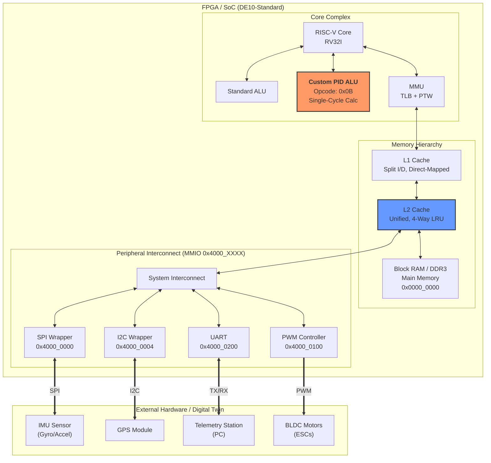

# AeroCore-V: RISC-V Flight Control SoC
[](https://github.com/shaanpatel00/aerocore-v/actions)

**AeroCore-V** is a specialized SystemVerilog System-on-Chip (SoC) designed for low-latency UAV flight control. It is targeted for the **Terasic DE10-Standard** (Cyclone V FPGA) and features a custom RISC-V core with hardware-accelerated PID control, a two-level cache hierarchy, and an MMU-protected kernel.

To ensure enterprise-grade reliability, the architecture is validated through a rigorous **Hardware-Software Co-Design Verification** pipeline, utilizing a Verilator C++ testbench, a custom TCP/UDP physics engine (Digital Twin), and automated CI workflows.

## Key Features

### Hardware (RTL)
* **Custom PID Extension**: Single-cycle `PID` instruction (Opcode `0x0B`) for ultra-low latency control loops.
* **Memory Hierarchy**:
    * **L1 Cache**: Split I/D, Direct-Mapped.
    * **L2 Cache**: Unified, 4-Way Set Associative with **True LRU** replacement to handle high-frequency sensor streams.
* **Memory Management**: Sv32-compliant **MMU** (TLB + Hardware Page Table Walker) for kernel/user isolation.
* **Peripherals**: Memory-mapped SPI (IMU), I2C (GPS), UART (Telemetry), and PWM Motor Controllers.

### Software & Toolchain
* **Bare-Metal Kernel**: A cooperative scheduler managing flight control (100Hz) and telemetry tasks.
* **Telemetry**: Real-time status reporting via UART using Q16.16 fixed-point formatting.
* **Scripting**: Python-based toolchains (`elf2hex.py`) and TCL build scripts to streamline the compilation-to-synthesis pipeline[cite: 2, 3].

### Verification & Validation (CI/CD)
* **Automated CI**: GitHub Actions automatically runs the Verilator simulation suite on every commit to ensure RTL integrity.
* **Peripheral Unit Testing**: C-based target tests (`uart_loopback_test.c`, `i2c_sensor_read.c`) validate hardware peripheral wrappers prior to kernel integration[cite: 2].
* **Digital Twin**: A Verilator-based simulation where the RTL drives a C++ physics engine, providing 3D OpenGL visualization of the drone's physical response to hardware signals in real-time.

---

## Memory-Mapped I/O (MMIO) Map
The SoC utilizes a standard memory-mapped interconnect architecture. Address space bit 30 determines RAM vs. IO routing.

| Base Address | Subsystem | Description |
| :--- | :--- | :--- |
| `0x00000000` | Main BRAM | Main memory for Instruction/Data; Boot ROM entry |
| `0x40000000` | SPI Wrapper | Interface for IMU (Gyro/Accel) telemetry acquisition |
| `0x40000004` | I2C Wrapper | Interface for GPS positioning data |
| `0x40000100` | PWM Controller| Motor thrust actuation registers |
| `0x40000200` | UART Controller| Telemetry station TX/RX console |
| `0x50000000` | PID Coprocessor| Memory-mapped registers for custom ALU extensions |

---

## Quick Start: Simulation & Build

**1. Run Verilator Tests (Linux/WSL):**
Ensure Verilator and standard build tools (`make`, `gcc`) are installed. This will run the C++ testbench and validate the core logic.
```bash
cd sim/verilator
make
```

**2. Launch the Digital Twin Physics Simulation:**
```bash
cd sim/digital_twin
make run
```

**3. Synthesize for Intel DE10-Standard (FPGA):**
Ensure Intel Quartus Prime is in your environment path to run the automated TCL build script.
```bash
cd fpga/scripts
quartus_sh -t build.tcl
```

## Architecture Diagram


## Hardware Architecture & Logic (RTL)
The hardware is a custom System-on-Chip (SoC) centered around a modified RISC-V core.  

### Top-Level Integration (`soc_top.sv`)
This module ties everything together. It instantiates the RISC-V core, memory, and peripherals. It maps memory addresses to specific hardware:
* **RAM**: `0x0000_0000` (Main Memory)
* **IO**: `0x4000_0000` (Peripherals) where bit 30 determines if an access is IO or RAM.
* **Motors**: Writes to `0x40000100` directly update the `motor_pwm` output signals.

### Custom PID Acceleration (`alu_pid.sv` & Pipeline)
Instead of calculating flight stability in software (slow), the core has a dedicated hardware unit.
* **Decode (`decode.sv`)**: Recognizes a custom opcode `OPCODE_CUSTOM0` (`0x0B`). When found, it asserts `pid_en` to enable the custom ALU.
* **ALU (`alu_pid.sv`)**: This unit performs the Proportional-Integral-Derivative (PID) math in parallel. It takes `error` and `prev_error`, applies fixed-point coefficients (`coeff_kp`, `coeff_ki`, `coeff_kd`), and outputs the control signal in a single clock cycle.
* **Execute (`execute.sv`)**: Muxes the standard ALU result with the PID result based on the `pid_en` signal.

### Memory System
* **MMU (`tlb.sv`)**: A Translation Lookaside Buffer translates virtual addresses to physical ones. It enforces permissions, ensuring User mode code (telemetry) cannot write to Supervisor pages (kernel).
* **L2 Cache (`l2_controller.sv`)**: Implements a 4-Way Set Associative cache with a True LRU (Least Recently Used) policy. It maintains an "LRU Matrix" (`lru_matrix`) to track access history and intelligently evict old data to keep the sensor stream smooth.

## Software Stack (Kernel)
The software is a bare-metal kernel that relies on the hardware features described above.

### Flight Loop (`pid.c`)
Reads sensor data from `0x40000000` (`SPI_DATA_REG`), calculates error, and invokes the hardware PID unit via inline assembly (`.insn r 0x0B...`). The result is written to `MOTOR_PWM_REG`.

### Scheduler (`sched.c`)
A simple cooperative scheduler runs in `main()`. It prioritizes the `pid_task()` (flight control) to ensure the drone stays stable, and runs `telemetry_task()` less frequently (every 100 ticks) to report status.

## Digital Twin Simulation
The project validates the hardware/software logic by coupling it with a C++ physics engine.

### Bridge (`bridge.cpp`)
This C++ program instantiates the Verilated hardware model (`Vsoc_top`).
1.  **Run Hardware**: It steps the hardware clock for 10,000 cycles.
2.  **Read Motor**: It "peeks" into the simulated FPGA memory (`top->motor_pwm`) to see what thrust the RISC-V core is requesting.
3.  **Update Physics**: It passes this thrust to `physics->update()`, which calculates the new altitude based on gravity, drag, and mass.
4.  **Feedback Loop**: The new altitude is converted back to sensor data and fed into the simulation inputs, closing the control loop.